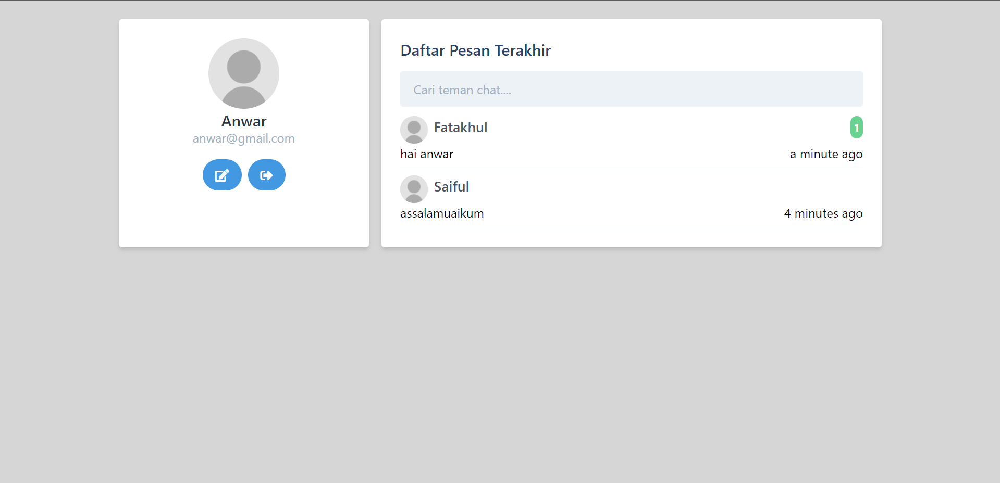

## Usage Application
> For helping to communicate with another person by text, image and audio using web application.

## How to run project
1. yarn install / npm install
2. yarn start / npm start

## Screenshots

  
  
  
  

## Application Features
- Login & Reguster user
- Email verification
- Reset password user
- Latest message from another user
- Search another user
- Chatroom
- Input message with text, photo, and audio
- Notification new message
- Online status another user
- User profil

## Framework & Libraries
- React JS
- Tailwind CSS
- Axios
- Sweatalert
- Moment JS

## API Project
You can visit at my another repository [https://github.com/afi11/Laravel-Lumen-Chat-Api-for-Web](https://github.com/afi11/Laravel-Lumen-Chat-Api-for-Web)